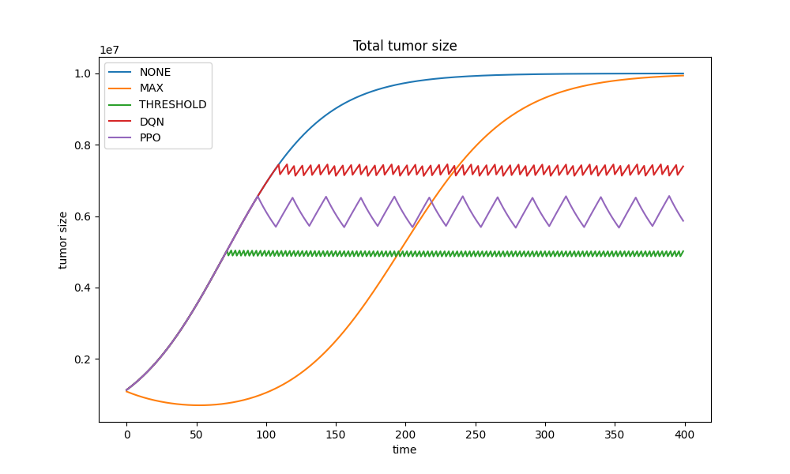
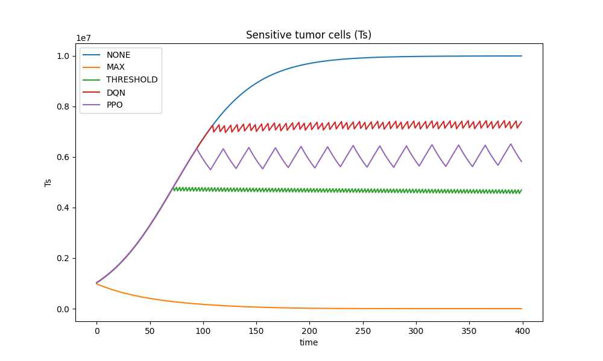
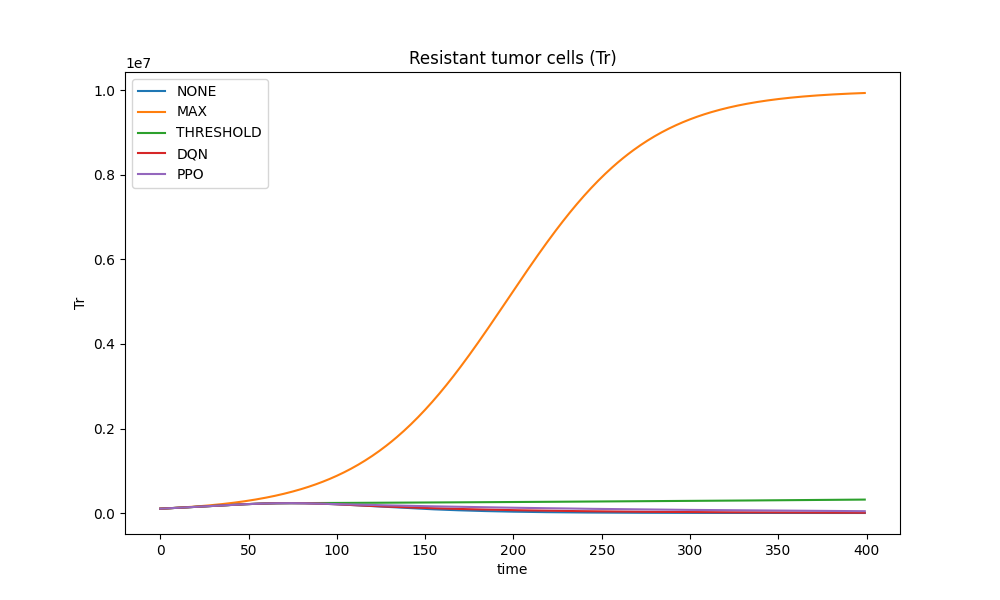
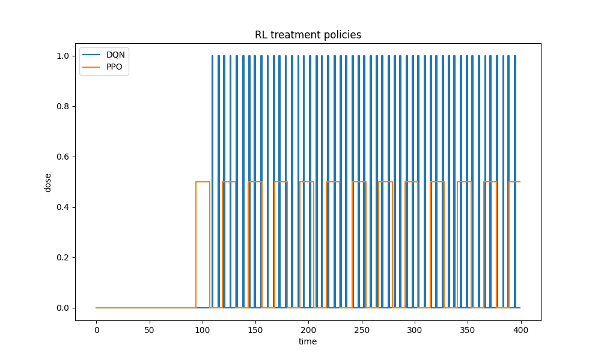

# Reinforcement Learning for Adaptive Cancer Therapy

This project implements a reinforcement learning framework for **adaptive cancer therapy optimization**.

The goal is to learn treatment strategies that control tumor growth while minimizing drug usage, inspired by evolutionary oncology and adaptive therapy principles.

🔗 **Repository**
https://github.com/ZeevWeizmann/rl-cancer-therapy

---

# Motivation

Traditional chemotherapy often applies **Maximum Tolerated Dose (MTD)** continuously.

While this can initially reduce tumor size, it often leads to **competitive release of resistant cancer cells**, causing tumor relapse.

Adaptive therapy proposes a different strategy:

tumor grows → apply therapy  
tumor shrinks → stop therapy

Instead of attempting to eradicate the tumor completely, the goal is to **maintain a stable tumor burden** and prevent resistant populations from dominating.

This project investigates whether **reinforcement learning agents can discover adaptive treatment strategies automatically**.

---

# Mathematical Model

The tumor is modeled as two competing populations:

• Sensitive cells (Ts)  
• Resistant cells (Tr)

Their dynamics follow a **Lotka–Volterra competition model**.

Sensitive population:

-\beta%20uT_s>)

Resistant population:

$$
\frac{dT_r}{dt} =
\alpha_r T_r
\left(
1 - \frac{T_r + c_{rs} T_s}{K}
\right)
$$

Where

| Parameter  | Meaning                  |
| ---------- | ------------------------ |
| K          | tumor carrying capacity  |
| αs, αr     | growth rates             |
| c_sr, c_rs | competition coefficients |
| u          | treatment dose           |

Treatment affects **only sensitive cells**, while resistant cells remain unaffected.

---

# Reinforcement Learning Environment

The RL agent does **not observe internal tumor populations directly**.

Instead it observes:

state = [ tumor size , tumor growth rate ]

Where

tumor size = (Ts + Tr) / scale  
growth rate = relative change in tumor size

This mimics a realistic clinical scenario where **only total tumor burden can be measured**.

---

# Action Space

The agent chooses among three treatment doses:

0.0 → no therapy  
0.5 → moderate therapy  
1.0 → maximum therapy

---

# Reward Function

The reward encourages the agent to maintain tumor size near a target level while minimizing treatment usage.

Target tumor level:

T\* = 0.5K

Reward:

$$
R = -\left(\frac{T - T^*}{K}\right)^2 - 0.5 \max(dT,0) - \lambda_d \cdot dose
$$

Where

- **T** — tumor size
- **T\*** — target tumor level (0.5K)
- **dT** — tumor growth rate
- **dose** — applied therapy
- **λ_d** — treatment penalty

This balances:

• tumor suppression  
• prevention of rapid growth  
• treatment toxicity reduction

---

# Environment Parameters

ALPHA_S = 0.03  
ALPHA_R = 0.025  
BETA = 0.045  
K = 1e7

C_SR = 1.0  
C_RS = 2.0

DT = 1.0  
MAX_STEPS = 400

DOSES = [0.0, 0.5, 1.0]  
DOSE_PENALTY = 0.2

The asymmetric competition coefficient

C_RS = 2.0

means that **sensitive cells strongly suppress resistant cells**, which is the key ecological mechanism behind adaptive therapy.

---

# Implemented Agents

Two reinforcement learning algorithms are implemented using **Stable-Baselines3**:

• DQN (Deep Q-Network)  
• PPO (Proximal Policy Optimization)

Both agents interact with the tumor environment to learn treatment policies.

---

# Baseline Policies

Several reference strategies are included.

No treatment:

dose = 0

Maximum therapy:

dose = 1

Threshold therapy:

if tumor > threshold:
treat
else:
stop therapy

---

# Results

The learned policies are compared against baseline strategies.

Typical behaviors:

| Policy    | Behavior                         |
| --------- | -------------------------------- |
| NONE      | tumor grows to carrying capacity |
| MAX       | resistant cells dominate         |
| THRESHOLD | stable tumor plateau             |
| RL        | adaptive treatment cycles        |

---

## Total Tumor Burden

The RL agents learn **oscillatory treatment strategies** that maintain tumor size near a stable equilibrium.

---

## Sensitive Cells

Adaptive therapy preserves sensitive cells to maintain competition with resistant populations.

---

## Resistant Cells

Maximum therapy leads to resistant takeover, while adaptive strategies maintain ecological balance.

---

## Treatment Schedule

The RL agent learns **dynamic therapy cycles** instead of fixed treatment schedules.

---

# Project Structure

rl-cancer-therapy

env/  
 tumor_env.py  
 parameters.py

training/  
 train_dqn.py  
 train_ppo.py

evaluation/  
 compare_models.py

utils/  
 simulation.py  
 plotting.py  
 metrics.py

results/  
 models/  
 plots/

run.sh

---

# Running the Project

Clone the repository:

git clone git@github.com:ZeevWeizmann/rl-cancer-therapy.git

Run training:

python training/train_dqn.py  
python training/train_ppo.py

Run the full pipeline:

./run.sh
